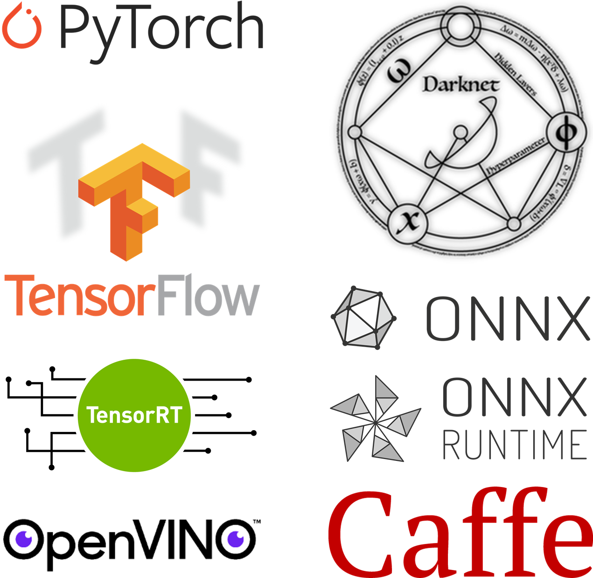

## [Download CV](https://WYLee-dev.github.io/assets\documents/WYLee_Curriculum_Vitae.pdf)

## Skills
**Programming language**

{: .align-center}

**Framework/Library**

{: .align-center}

**OS**

{: .align-center}

## Research Interests
주 관심 분야는 딥러닝 기반 영상처리고 컴퓨터 비전 분야에 사용하는 딥러닝 모델을 학습하고 변환하는 업무를 주로 수행하고 있습니다.

Classification, Object detection, Instance segmentation, Person Re-Identification 분야에 사용하는 딥러닝 모델을 직접 학습한 경험이 있습니다.

LibTorch, ONNX, ONNX Runtime, TensorRT, OpenVINO를 이용하여 Python에서 학습한 모델을 C++에서 사용 가능한 형태로 변환한 경험이 있습니다.

## Experience
**한국생산기술연구원**
```
융합기술연구소 로봇응용연구부문 연구원(전문연구요원)
재직기간: 2019.11~현재
담당 업무
- Object Detection 분야 딥러닝 모델 개발
- Instance Segmentation 분야 딥러닝 모델 개발
- Instance Segmentation 모델 학습용 데이터 태깅 툴 개발
- 딥러닝 모델 inference를 위한 C++ 기반 DLL 개발
- python 기반 UR5e 로봇 제어 프로그램 개발
```
**(주)인텔리빅스**
```
영상정보처리연구소 AI개발팀 연구원(전문연구요원)
재직기간: 2018.02~2019.11
담당 업무
- Classification 분야 딥러닝 모델 개발
- Object Detection 분야 딥러닝 모델 개발
- Person Re-Identification 분야 딥러닝 모델 개발
- 딥러닝 모델 inference를 위한 C++ 기반 DLL 개발
```

## Education
**M.S. in Electrical and Electronics Engineering**
```
중앙대학교 일반대학원 전자전기공학과 석사 졸업(제어 및 시스템 전공)
지도교수: 심귀보 교수님(유비쿼터스로봇 및 지능정보시스템 연구실)
학위논문: 최적의 CNN 구조 설계를 위한 HS 알고리즘 기반 하이퍼파라미터 결정 방법
재학기간: 2016.03~2018.02
```
**B.S. in Electrical and Electronics Engineering**
```
중앙대학교 공과대학 전자전기공학과 졸업
재학기간: 2012.03~2016.02
```

## Projects
**시설원예 모니터링, 방제, 수확, 이송 작업의 무인 자동화를 위한 로봇시스템과 작업체계 개발(산업통상자원부)**
```
과제내용: 시설원예 무인 자동화를 위한 다목적 로봇 시스템 및 작업체계 개발
과제참여기간: 2019.11~현재
담당 업무
- Instance Segmentation 모델 학습용 데이터 태깅 툴 개발
- 토마토 인식을 위한 딥러닝 기반 Instance Segmentation 모델 학습 및 모델 inference를 위한 C++ 기반 DLL 개발
- UR5e 로봇 원격 제어용 프로그램 개발
개발 언어: C++, Python
```

**설치가 용이한 지능형 다관절 식사보조 로봇 개발(산업통상자원부)**
```
과제내용: 고령자 및 장애인을 위한 인공지능 기반 식사 보조 및 식사 이력 관리 기능을 갖는 돌봄 로봇 개발
과제참여기간: 2019.11~현재
담당 업무
- 안드로이드 어플리케이션에서 사용 가능한 형태로 딥러닝 기반 Object Detection 모델 변환
개발 언어: Python
```

**수중 작업 편의성 향상을 위한 지능형 해양로봇 개발(한국생산기술연구원 내부과제)**
```
과제내용: 수중 작업 편의성 향상을 위한 지능형 해양로봇 개발을 위한 요소 기술 개발
과제참여기간: 2020.01~현재
담당 업무
- 수중 객체 인식을 위한 딥러닝 기반 Object Detection 모델 학습
개발 언어: C++
```

**CCTV 제약점 개선을 통해 범인 검거율 저하 문제 해결을 지원하는 지능형 영상 보안 시스템 기술 개발(과학기술정보통신부)**
```
과제내용: 고속 이동 객체, 원거리 소형 객체, 가려짐 객체 등 CCTV의 제약으로 인한 범인 검거율 저하 문제 해결을 지원하는 지능형 영상보안 시스템 개발
과제참여기간: 2018.06~2019.11
담당 업무
- 딥러닝 기반 Person Re-Identification 모델 학습
- Person Re-Identification 모델, 얼굴 인식 모델의 inference를 위한 C++ 기반 DLL 개발
개발 언어: C++, Python
```

**5G 기반의 스마트시티 서비스 개발 및 실증((재)기가코리아사업단)**
```
과제내용: 5G 기반의 스마트시티 구현을 위한 서비스 요소 기술 개발 및 실증
과제참여기간: 2019.01~~2019.11
담당 업무
- 사회적 약자, 화재 검출을 위한 딥러닝 기반 Object Detection 모델 학습
개발 언어: C++
```

**신발갑피 열용융 접착재봉(Fuse Sewing) 공정용 로봇시스템 개발(산업통상자원부)**
```
과제내용: 신발 갑피 제작 공정 자동화를 위한 열용융 접착재봉(Fuse Sewing) 공정용 로봇 시스템 개발
과제참여기간: 2016.05~2017.12
담당 업무
- 신발 갑피 패턴 분류를 위한 딥러닝 기반 Classification 모델 학습
- 신발 갑피 점착제 도포를 위한 경로점 생성 및 점착제 도포 경로 생성 알고리즘 개발
개발 언어: C++, MATLAB
```

## Patents
[1] Kwee-Bo Sim and **Woo-Young Lee**, Terminal device and Method for setting hyperparameter of convolutional neural network, KR-Registration, 10–2129161-0000.[[link]](https://doi.org/10.8080/1020170183585)

[2] Kwee-Bo Sim and **Woo-Young Lee**, Method for deriving optimal solution using the HS algorithm and Terminal device for performing the same, KR-Registration, 10–2042323-0000.[[link]](https://doi.org/10.8080/1020170183583)

## Publications(SCIE)
[1] **W.-Y. Lee**, S.-M. Park, and K.-B. Sim, “Optimal hyperparameter tuning of convolutional neural networks based on the parameter-setting-free harmony search algorithm”, Optik, vol. 172, pp. 359–367, 2018. [[link]](https://doi.org/10.1016/j.ijleo.2018.07.044)

[2] **W.-Y. Lee**, K.-E. Ko, and K.-B. Sim, “Robust lip detection based on histogram of oriented gradient features and convolutional neural network under effects of light and background”, Optik, vol. 136, pp. 462–469, 2017. [[link]](https://doi.org/10.1016/j.ijleo.2017.02.017)

## Publications(domestic)
[1] **W.-Y. Lee**, S.-W. Lee, S. M. Park, T.-H. Kim, Z. W. Geem, I.-H. Geem, and K.-B. Sim, “Generating a adhesive nozzle path by the parameter-setting-free harmony search algorithm for a shoe-upper assembly process”, Journal of Korean Institute of Intelligent Systems, vol. 28, no. 1, pp. 49–56, 2018. [[link]](http://doi.org/10.5391/JKIIS.2018.28.1.49)

[2] **W.-Y. Lee**, K.-E. Ko, Z.-W. Geem, and K.-B. Sim, “Method that determining the hyperparameter of cnn using hs algorithm”, Journal of Korean institute of intelligent systems, vol. 27, no. 1, pp. 22–28, 2017. [[link]](https://doi.org/10.5391/JKIIS.2017.27.1.022)

[3] **W.-Y. Lee**, S.-M. Park, I. Jang, T.-H. Kim, and K.-B. Sim, “Cnn-based shoe-upper pattern recognition and generation of adhesive point”, Journal of Institute of Control, Robotics and Systems, vol. 23, pp. 725–731, 2017. [[link]](https://doi.org/10.5302/J.ICROS.2017.17.0109)

[4] J.-W. Kim, **W.-Y. Lee**, J.-H. Yu, and K.-B. Sim, “Autonomous mobile robot control using the wearable devices based on emg signal for detecting fire”, Journal of Korean Institute of Intelligent Systems, vol. 26, no. 3, pp. 176–181, 2016. [[link]](https://doi.org/10.5391/JKIIS.2016.26.3.176)

[5] **W.-Y. Lee**, H.-M. Ko, J.-H. Yu, and K.-B. Sim, “An implementation of smart dormitory system based on internet of things”, Journal of Korean Institute of Intelligent Systems, vol. 26, no. 4, pp. 295–300, 2016. [[link]](https://doi.org/10.5391/JKIIS.2016.26.4.295)

## Awards
[1] Best paper award at 2017 Korea Institute of Intelligent Systems autumn conference	(2017.11)

[2] Best paper award at 2016 Korea Institute of Intelligent Systems autumn conference	(2016.10)
